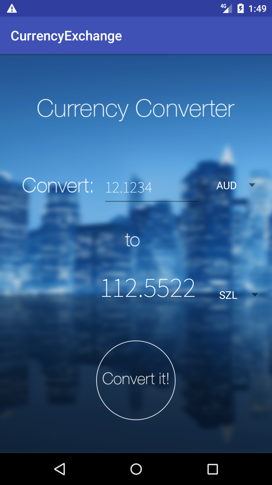
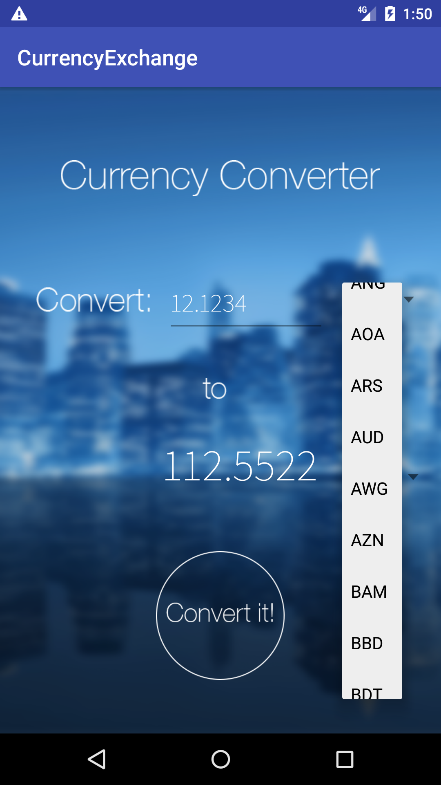
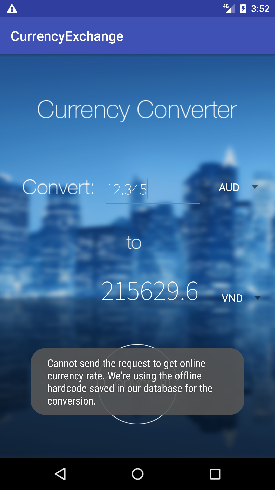

# mobile_application_development

## Exercise 1

This exercise includes 2 parts.

You can download this source code, run and visit at localhost:3333/ to test this exercise. (To run: go to the folder including this code. On terminal, run 'node Ex1/app.js)

### Part 1:
You can get address from the existing latitude and longitude by requesting a GET request at /latlng2Place/$latitude&$longitude.

### Part 2:
You can calculate the distance between 2 points in the Earth supposed (latitude1, longitude1) and (latitude2, longitude2) by requesting a GET request at /getDistance/$latitude1&$longitude1$&latitude2&$longitude2.

### For example:
- Request localhost:3333/latlng2Place/10.810583&106.709145 in order to get address from the defined coordinates (longitude and latitude), where 10.810583 is the latitude and 106.709145 is the longitude.
- Request localhost:3333/getDistance/10.810583&106.709145&10.863731&106.779495 to get the distance between 2 positions - (10.810583, 106.709145) and (10.863731, 106.779495).
  

## Exercise 2
Ứng dụng chuyển đổi tiền tệ Currency Converter.
- Người dùng có thể nhập số tiền cần chuyển đổi, sau đó click chọn vào 2 ô spinner tương ứng với đơn vị tiền tệ muốn chuyển đổi, và nhấn vào nút "Convert it!" để chuyển đổi tiền tệ.




- Ứng dụng tham khảo tỉ giá tiền tệ từ api của http://apilayer.net/.
- Một ví dụ để lấy tỉ giá USD và VND:
```
http://apilayer.net/api/live?access_key=9ffb64d184d4ccbc8bbb4879f68bafdb&currencies=VND&source=USD&format=1
```
- Khi ứng dụng không thể gửi request được thì tỉ giá tiền tệ được dùng là tỉ giá hardcode được lưu sẵn, đồng thời ứng dụng sẽ thông báo cho người dùng biết như hình bên dưới.

